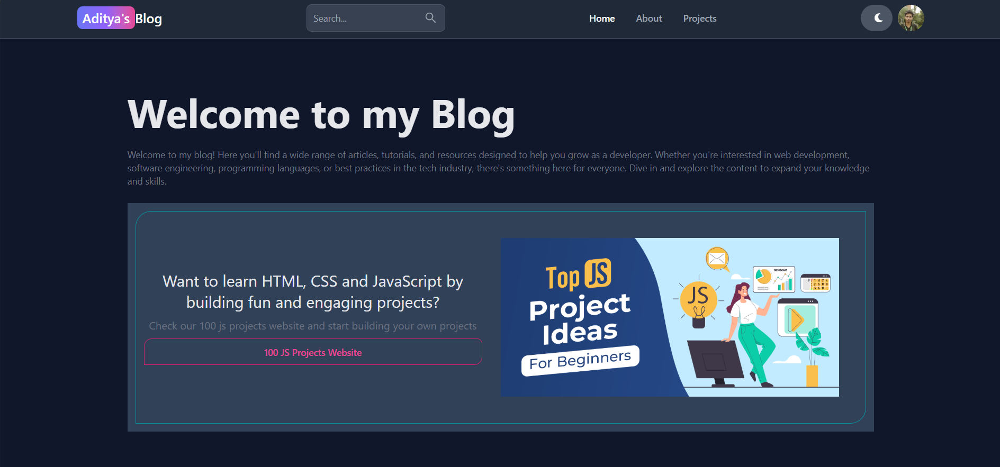
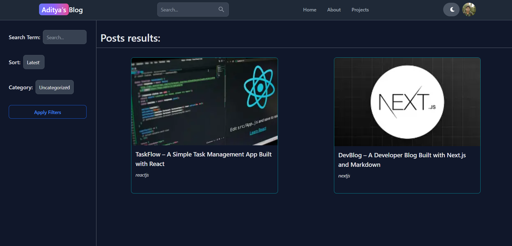
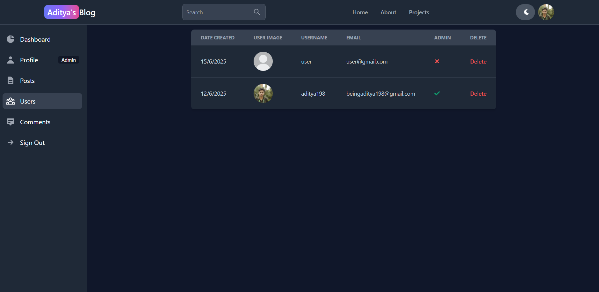
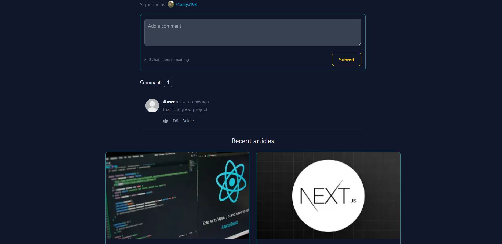

# 📝 BlogApp (MERN Stack)

A modern, full-featured blogging platform built with the **MERN stack** (MongoDB, Express.js, React.js, Node.js) featuring secure authentication, a rich editor, user dashboards, and a beautiful reading and writing experience.

---

## 🚀 Features

### 🔐 User Authentication
- Secure registration & login (JWT-based)
- OAuth login (Google, etc.)
- Role-based protected routes (admin/user)

### ✍️ Blogging
- Create, edit, and delete blog posts
- Rich text editor with image upload (Cloudinary)
- Tagging, search, and filtering

### 💬 Comments
- Add, edit, and delete comments on posts
- Real-time comment updates

### 🧑‍💼 User & Admin Dashboard
- Manage your posts and comments
- Admin: manage users, posts, and comments

---

## 📸 Demo UI Preview

| Home Page                                   | Post Page                                         | Admin Dashboard                                   |
| -------------------------------------------- | ------------------------------------------------- | ------------------------------------------------- |
|  |    |  |

---

## 🖼️ Screenshots

### 🏠 Home Page


### 📝 Post Details


### 💬 Comments Section



### 🧑‍💼 Admin Dashboard


---

## 🧰 Tech Stack

### 🖥️ Frontend
- React.js + Tailwind CSS + Flowbite
- Vite + React Router DOM
- Redux Toolkit + Redux Persist
- Axios + React Toastify
- Firebase (OAuth)

### 🖥️ Backend
- Node.js + Express.js
- MongoDB + Mongoose
- JWT + Bcrypt
- Multer + Cloudinary

---

## ⚙️ Installation Guide

### ✅ Prerequisites
- Node.js (v14 or later)
- MongoDB
- npm or yarn

### 🔧 Setup Instructions

1. **Clone the Repository**
   ```bash
   git clone <repository-url>
   cd BlogApp
   ```
2. **Install Backend Dependencies**
   ```bash
   cd Backend
   npm install
   ```
4. **Start the Backend Server**
   ```bash
   npm start
   ```
5. **Install Frontend Dependencies**
   ```bash
   cd ../Frontend
   npm install
   ```
6. **Set Up Firebase (if using OAuth)**
   - Configure Firebase in `Frontend/firebase.js`.
7. **Start the Frontend Dev Server**
   ```bash
   npm run dev
   ```

---
